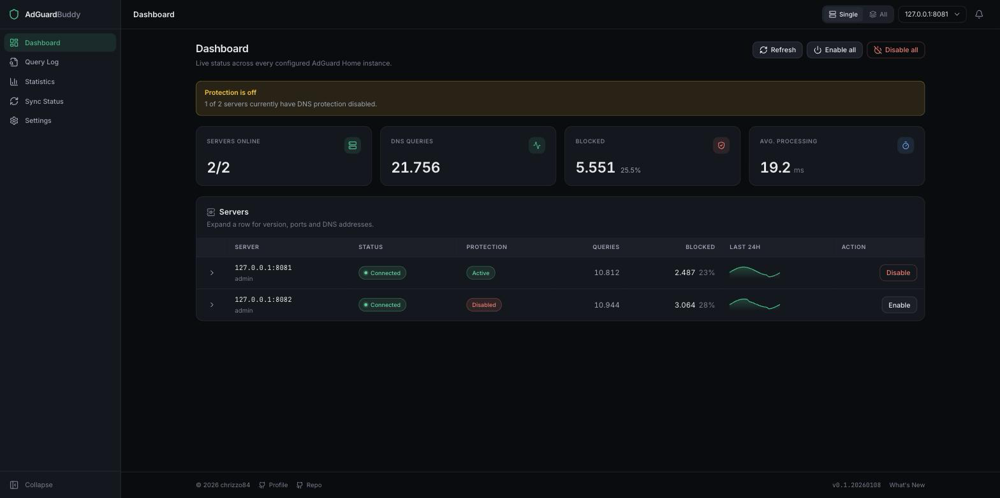
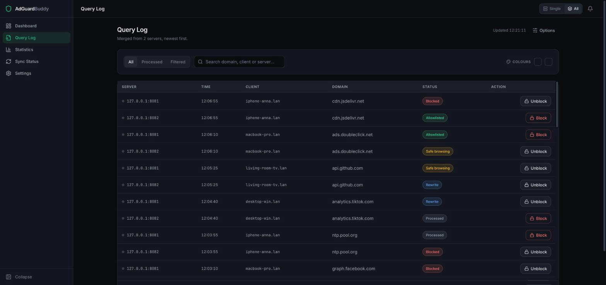
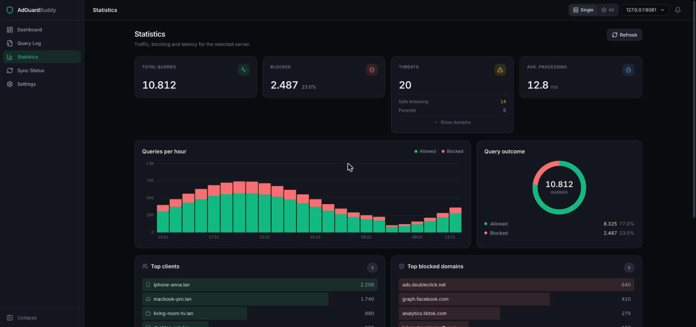
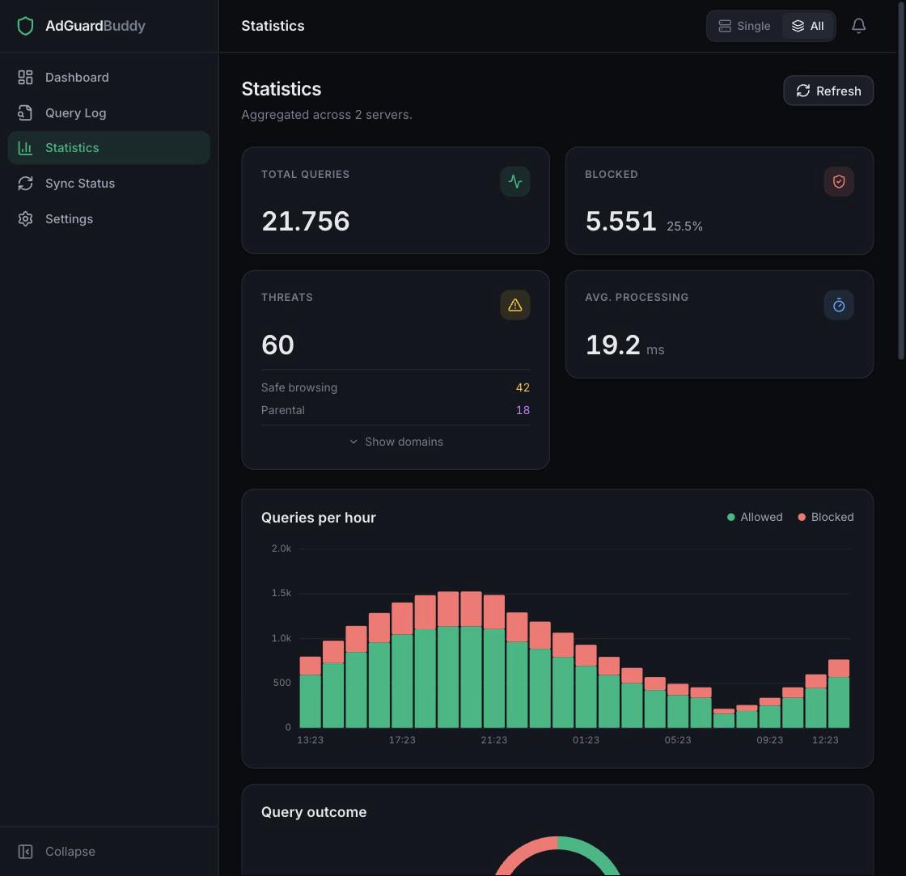
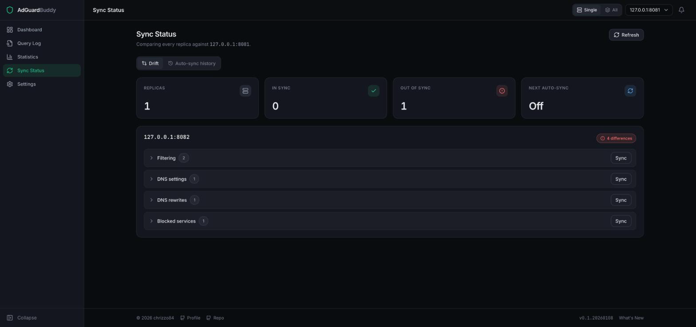
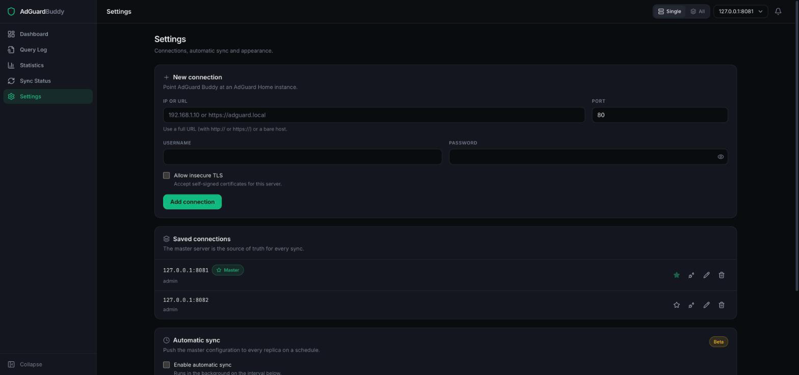

<p align="center">
	
</p>

# AdGuard Buddy


> A modern dashboard & API interface for AdGuard Home – simple, fast, and clear.

---

## 🎯 Goal

**AdGuard Buddy** is designed to keep multiple AdGuard Home instances synchronized, allowing you to monitor statistics, logs, and settings of all your AdGuard servers in one place. 

One server acts as the master, and its settings can be synchronized to the other servers. The Sync view clearly shows when servers are not in sync with the master, so you always know the current status. Easily view, manage, and control several AdGuard installations from a single point – perfect for users with multiple AdGuard instances.

---

---

## 🚀 Features

- Fleet dashboard with per-server status, protection toggles and 24h trend
- Merged query log across all servers, with search and one-click block/unblock
- Statistics with real per-hour history, no simulated data
- Drift view against a master server, plus scheduled auto-sync
- Server-side credential handling with optional HTTP Basic auth
- Docker support

---

## 🛠️ Installation

### Local

```bash
pnpm install
pnpm dev
```

### Pre-Build Image:

You can find it here:
https://github.com/chrizzo84/adguard-buddy/pkgs/container/adguard-buddy

### Docker

```bash
docker build -t adguard-buddy .
docker run -p 3000:3000 \
  -e ADGUARD_BUDDY_ENCRYPTION_KEY="your-strong-key" \
  -v adguard-buddy-data:/app/.data \
  -v adguard-buddy-logs:/app/logs \
  adguard-buddy
```

`/app/.data` holds your connections; mount it as a volume or the configuration
is lost when the container is recreated.

---

## 🧪 Development & Testing

### Available Scripts

```bash
# Development
pnpm dev              # Start development server
pnpm build           # Build for production
pnpm start           # Start production server

# Testing
pnpm test            # Run tests
pnpm test:watch      # Run tests in watch mode
pnpm test:coverage   # Run tests with coverage report
pnpm test:ci         # Run tests for CI (no watch)

# Code Quality
pnpm lint            # Run ESLint
pnpm lint:fix        # Run ESLint with auto-fix
pnpm type-check      # Run TypeScript type checking

# Combined
pnpm ci              # Run lint + type-check + test:ci
pnpm pre-commit      # Run lint + test (for pre-commit hooks)
```

### Testing Overview

- **Framework:** Jest with React Testing Library
- **CI/CD:** Automated testing on every push/PR

Run `pnpm test:coverage` for the current numbers; `src/lib` (crypto, credential
store, validation, settings diff) is the part worth keeping close to 100%.

### CI/CD Pipeline

The project uses GitHub Actions for automated testing and quality assurance:

- **Build & Test:** Runs on every push and PR
- **Linting:** ESLint with zero warnings allowed
- **Type Checking:** Full TypeScript compilation check
- **Coverage:** Automated coverage reporting with Codecov
- **Security:** Dependency vulnerability scanning
- **Performance:** Lighthouse performance monitoring
- **Docker:** Automated container builds and publishing

### Workflow Files

- `.github/workflows/build-only.yml` - Main CI pipeline
- `.github/workflows/security.yml` - Security and dependency checks
- `.github/workflows/quality.yml` - Code quality monitoring
- `.github/workflows/performance.yml` - Performance and Lighthouse
- `.github/workflows/docker-publish.yml` - Docker publishing

---

## 🔐 Security

AdGuard Buddy can disable protection and rewrite filter rules on every server it
knows about, so treat the instance itself as a privileged admin surface.

**Credentials never reach the browser.** Passwords are encrypted at rest with
AES-256-GCM (scrypt-derived key) and decrypted only inside API routes. The
browser addresses a server by its connection id; `/api/get-connections` returns
no password field at all.

**Enable authentication** unless the instance is on a fully trusted network:

```bash
export ADGUARD_BUDDY_AUTH_USER="admin"
export ADGUARD_BUDDY_AUTH_PASSWORD="a-long-random-password"
```

With both set, every route requires HTTP Basic auth. Leaving them unset keeps the
app open, which is only appropriate behind another layer of access control.

## ⚙️ Environment Variables

| Variable | Required | Purpose |
|---|---|---|
| `ADGUARD_BUDDY_ENCRYPTION_KEY` | recommended | Encrypts AdGuard Home passwords in `.data/connections.json`. Defaults to `adguard-buddy-key`, which is not safe for real credentials. |
| `ADGUARD_BUDDY_AUTH_USER` | optional | Username for HTTP Basic auth. Auth is off unless this and the password are both set. |
| `ADGUARD_BUDDY_AUTH_PASSWORD` | optional | Password for HTTP Basic auth. |

```bash
export ADGUARD_BUDDY_ENCRYPTION_KEY="your-strong-key"
```

> **Migrating from `NEXT_PUBLIC_ADGUARD_BUDDY_ENCRYPTION_KEY`:** that variable was
> embedded in the browser bundle, so the key it held should be considered public.
> It is still read as a fallback and existing stored passwords are transparently
> re-encrypted on first read, but rename it to `ADGUARD_BUDDY_ENCRYPTION_KEY` and
> rotate your AdGuard Home passwords.

---

## 📋 API Endpoints

Routes that talk to an AdGuard Home instance take a `connectionId` — the
normalized `url` or `ip:port` of a stored connection — and never credentials:

- `/api/get-connections` – configured servers, without passwords
- `/api/save-connections` – replace the server list (plaintext passwords in, ciphertext at rest)
- `/api/check-adguard` – status + stats for one server
- `/api/adguard-control` – toggle protection
- `/api/query-log` – query log for one server
- `/api/statistics`, `/api/statistics/combined` – per-server and aggregated stats
- `/api/get-all-settings` – every settings endpoint for one server
- `/api/set-filtering-rule` – add/remove a block rule (SSE progress)
- `/api/sync-category` – push one category from master to a replica (SSE progress)
- `/api/auto-sync-config`, `/api/auto-sync-pause`, `/api/auto-sync-trigger` – scheduler

---

## 🖼️ Screenshots


---
---

---
---


---
---

---
---


---

## 🤝 Contributors

- [chrizzo84](https://github.com/chrizzo84) – Maintainer

---

## 📄 License

MIT

